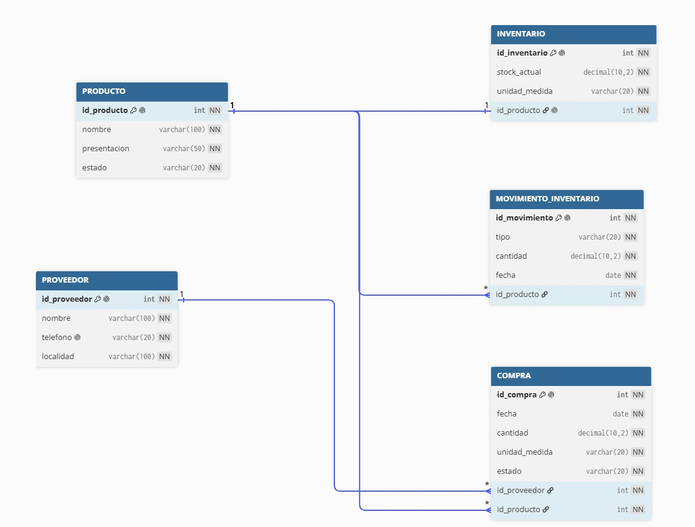

# SistemaCostenita
> **Sistema de Información y Gestión de Inventarios para Microempresa Apícola**  
> *Villa Montes, Tarija – Bolivia | Gestión 2026*

---

### 🍯 Sobre el Proyecto

**Costeñita** es un sistema de información web (MVP) diseñado para optimizar, estandarizar y transparentar la cadena de acopio, control de existencias y comercialización de miel y derivados apícolas en el Gran Chaco boliviano. 

El software resuelve la desarticulación operativa tradicional mediante:
* **Acopio de Materia Prima por Peso (KG):** Recepción y liquidación de miel cruda a granel adquirida a apicultores locales.
* **Descuento Cruzado de Inventario:** Conversión y deducción automática del stock de materia prima bruta ante la venta de presentaciones comerciales envasadas (250 g, 500 g, 1 kg).
* **Control Financiero en Moneda Nacional:** Valorización de inventarios y liquidaciones comerciales expresadas en Bolivianos (Bs.).
* **Blindaje Legal y Auditoría Inalterable:** Cumplimiento de la **Ley N° 164**, **CPE Art. 130 (Hábeas Data)** y **Código Penal Boliviano (Art. 363 bis/ter)** mediante registros de auditoría encadenados con SHA-256 y protección criptográfica.

---

### 🎯 Impacto Socioambiental y ODS

Este proyecto se encuentra alineado con los Objetivos de Desarrollo Sostenible (CEPAL):
* **ODS 8 (Trabajo Decente y Crecimiento Económico):** Fomento al comercio justo y formalización operativa de los pequeños apicultores del Chaco.
* **ODS 9 (Industria, Innovación e Infraestructura):** Digitalización de procesos productivos para microempresas locales.
* **ODS 16 (Paz, Justicia e Instituciones Sólidas):** Transparencia, rendición de cuentas y trazabilidad inalterable de transacciones comerciales.

---

### 🛠️ Stack Tecnológico

* **Frontend:** React + TypeScript + Vite + Tailwind CSS.
* **Backend & Base de Datos:** Supabase / PostgreSQL (Diseño relacional en 3ra Forma Normal).
* **Seguridad:** Row Level Security (RLS), Extensiones `pgcrypto` y Triggers PL/pgSQL.
* **Modelado & Diseño:** UML (PlantUML) y Prototipado UX/UI.

---

### 👥 Equipo de Desarrollo

* **Ronny Guillermo Altamirano Suarez** — *Universidad Privada Domingo Savio (UPDS - Sede Tarija)*
* **Miguel Angel Lopez Villca** — *Universidad Privada Domingo Savio (UPDS - Sede Tarija)*
* **Docente Guía:** Ing. Nelson Huanca
* **Materia:** Sistemas de Información I
*
## Diagrama de Base de Datos

El siguiente diagrama representa la arquitectura de datos de Costeñita correspondiente al Split 1 (HU01–HU06), incluyendo las entidades, claves primarias, claves foráneas y relaciones entre las tablas.

